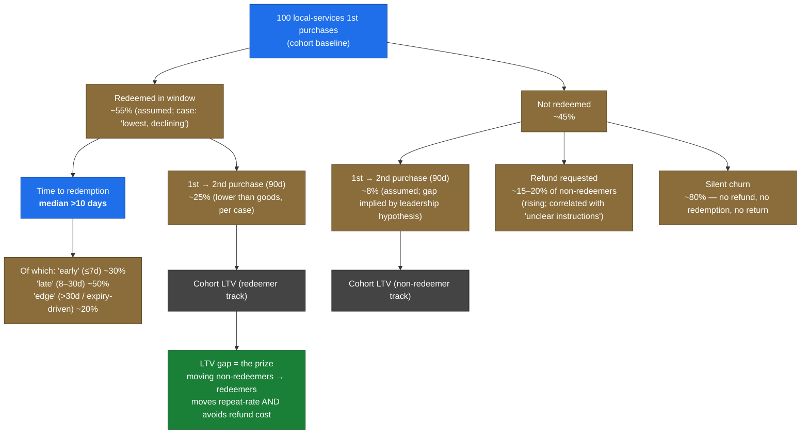

# Phase 2 — Diagnosis

## 1. Metrics tree (purchase → redemption → repeat → LTV)

Numbers in **bold** are from the case. Numbers in *italics* are stated assumptions used to size the prize; they would be confirmed on day 1 with data access. The tree is local-services-first because that's where the leak lives.

**What the tree forces us to see:**

1. The non-redeemer branch is the bigger commercial loss. They drag down repeat (8% vs. 25%) *and* generate refund cost. Moving 5pp of non-redeemers → redeemers is worth roughly the same as moving 15pp of redeemers → repeat-purchasers (and is almost certainly easier).
2. Redemption is not a single event. It splits into early / late / edge — and a strategy that helps "early" redeemers won't move "edge" ones. We must decide which sub-segment we're chasing.
3. The leadership hypothesis is *testable* on this tree: it requires `LTV(redeemer) − LTV(non-redeemer)` to be large after controlling for selection. We should not commit to it before checking; selection bias (more engaged buyers both redeem AND return) could be overstating the effect.

---

## 2. Three root-cause hypotheses

All three live inside T2 (the first 48-hour window decides most of it). They differ on *what specifically breaks* in that window.

### H1. Salience decay — the commitment moment never happens
> Local-services buyers purchase with vague future intent ("I should get a massage sometime"). The product never converts that purchase into a *commitment* (a planned date, a calendar hold, a booking). Without commitment, attention decays — by day 10 the voucher is competing with everything else in the user's life.

**Supports:** Median TTR >10 days; "How do I use this?" is the top contact (people surface intent late, with cold context); refund-with-unclear-instructions correlation (deals expire → friction surfaces → refund). The goods/local repeat gap (T3) is explained: goods doesn't require a separate "decide when" step, so there's no salience drop.

**Contradicts:** If salience were the dominant driver we'd expect a sharp redemption cliff near expiry (deadline-driven action). We don't know if that's the actual shape — could be a uniform tail. Also doesn't explain merchant-side complaints in public reviews (those are real, just out of our scope per T1).

**Must be true for H1 to be root cause:** Redemption rate is meaningfully higher among users who take any "next step" (calendar add, save to wallet, view-merchant-page) within 48 hours. If we can't show that lift, this is the wrong root.

---

### H2. Per-deal-type next-step ambiguity
> The post-purchase product treats every voucher as the same object ("here's your code"). But local sub-categories require completely different first actions: a restaurant needs an OpenTable booking, a massage needs a phone call to the specific spa, a class needs a date-pick on the merchant's site, an "things to do" activity might be walk-in. The generic redemption surface doesn't distinguish, so users freeze.

**Supports:** "How do I use this?" is the literal top support query. AppComrade/Trustpilot reviews describe users *defaulting to phoning the merchant* — i.e., they figured out the right action eventually but the product didn't tell them. Per-sub-category redemption variation (which we'd need to confirm) is consistent with information-design as root.

**Contradicts:** If H2 were primary, fixing the confirmation copy should already have moved the metric. It hasn't been done well, but redemption FAQs and how-to pages exist; the data is still declining. Suggests the problem is deeper than instructions.

**Must be true for H2 to be root cause:** Redemption rates differ meaningfully *across* local sub-categories, with the lowest belonging to sub-categories that have the most ambiguous next-step (e.g., massage/wellness > events > restaurants). If they're all similarly bad, it's not an info-design problem.

---

### H3. Confirmation-as-receipt, not as activation
> The checkout-complete moment is product-framed as a receipt ("thanks, here's your purchase") rather than as the start of a job. The buyer's mental model shifts from "I'm buying a thing" to "I bought a thing" — past tense — when it should be "I'm now going to use this thing." Every downstream comms follows the receipt frame.

**Supports:** It's a coherent reading of why goods buyers don't have this problem (the receipt frame matches reality — the next event is "package arrives," handled for them) and local buyers do (the receipt frame is wrong — the journey has barely started). Explains why static FAQ improvements never moved the needle.

**Contradicts:** This is a framing claim, and framing claims are seductive but slippery. Even with a perfect activation-framed confirmation, if the next step is *genuinely* high-friction (call this spa, navigate their booking system), the frame won't carry it. H3 explains the surface; H1/H2 explain the substance.

**Must be true for H3 to be root cause:** A confirmation-flow change alone, with no per-deal-type or commitment-moment improvement, moves redemption by enough to matter. I'd estimate the ceiling on H3 alone is small (1–2pp).

---

## 3. Steel-man / adversarial pass

| Tension | What it surfaces |
|---|---|
| **H1 vs. H2.** H2 advocate: "If you make the next step crystal clear, salience takes care of itself — people act when they know what to do." H1 advocate: "Clarity is necessary but not sufficient — people know they should book the massage; they don't because they haven't *committed* to a date." | The interesting test is the order: does clarity-without-commitment beat commitment-without-clarity? Likely commitment wins, because commitment forces specificity (you can't add a calendar hold without picking a time). |
| **H1 vs. H3.** H3 says fix the frame at checkout; H1 says fix the behavior across 48 hours. | H1 is the larger surface (whole window) — H3 is one moment inside H1. If forced to choose, H1 dominates by inclusion. |
| **H2 vs. H3.** | Both are content/UX problems. H2 is *deal-aware* content. H3 is *frame-aware* content. H2 is more actionable, more measurable, more clearly AI-leveraged. |
| **All three vs. T3 (goods reframe).** | T3 says goods has higher repeat because shipping completes the redemption *for* the user. That implication: the goal of all three Hs is to make local feel more like goods — to *complete the activation for the user* (book the slot, hold the time, set the reminder) rather than handing them a code and walking away. H1 is most consistent with that goal. |

## 4. My recommendation

**Primary diagnosis: H1 (salience decay / missing commitment moment).**  
**Embedded secondary: H2 (per-deal-type next-step ambiguity).**

H1 is the root because it explains the data signals we have *and* the cross-deal-type gap (T3) *and* the refund correlation. H2 is secondary because it's a near-mandatory enabler of H1 — you can't create a commitment moment that's deal-type-blind — but it's not load-bearing on its own. H3 collapses into H1 (a fix at the checkout-complete moment is one moment in the 48-hour window H1 is about).

The reason H2 is secondary, not co-primary: if I built a beautiful per-deal-type "how to redeem" page and shipped no commitment mechanic, I would move support contacts but not move repeat-purchase rate. If I built a strong commitment mechanic, the per-deal-type clarity comes along for free (the booking widget for restaurants vs. the call-now CTA for massage is content the commitment mechanic *needs*).

---

## Checkpoint 2

**Which is the root cause, and what would have to be true for you to be wrong?**

My recommendation, restated tightly:
- Root cause: **H1 (salience decay).** A first-purchase voucher for a local service is never converted into a planned action, so it decays out of the user's attention by day ~10, by which point the cost of acting feels higher than the benefit of using the voucher.
- I would be wrong if: redemption is *not* significantly higher among users who take any "next step" within 48 hours; OR the redemption curve shows a hard expiry-cliff rather than a long decay (which would mean intent is preserved and friction is the actual root).
- Secondary: **H2 (per-deal-type next-step ambiguity)** — necessary but not sufficient. Worth shipping because it powers H1, not because it solves the problem on its own.

Waiting for your call before I write the diagnosis section.
